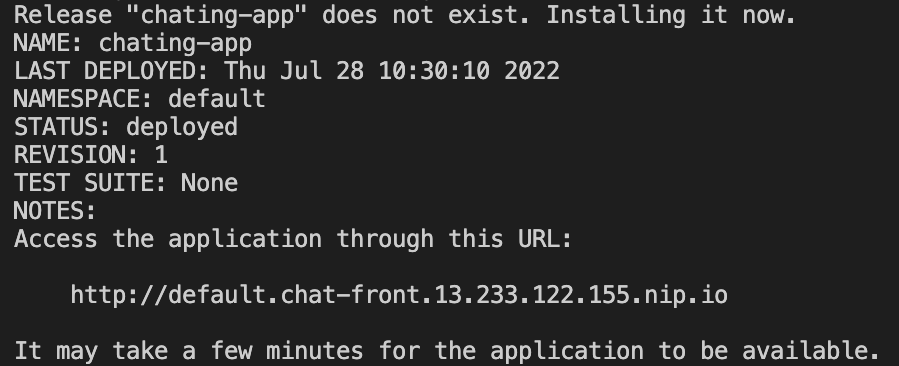

# Chating-App

This is a example of 3 microservices and a database working in a Kubernetes
cluster.

- **chat_front:** Simple webpage that sends and receives messages from chat_svc
  through socket io
- **chat_svc:** Receives messages from chat_front and sends these messages to
  chat_db to store this information
- **chat_db:** Receives data from chat_svc and stores this information in a
  SQLite DB.

## Architecture


## Steps

1. Create the docker images:

```bash
docker build -t chat_db:v1 ./chat_db/
docker build -t chat_svc:v1 ./chat_svc/
docker build -t chat_front:v1 ./chat_front/
```

2. Update the clusterIP in helm chart `values.yaml`

```
clusterIP: 13.233.122.155
```

3. Check your helm chart:

```bash
helm upgrade --dry-run --install chating-app ./helm_chart/
```

4. Install the helm chart:

```bash
helm upgrade --install chating-app ./helm_chart/
```



5. Verify that all pods are OK:

```bash
kubectl get pods
```


5. Open the link as mentioned and see the magic :)
   `http://namespace.chat_front_serviceName.clusterIP.clusterDomain`


---

This project of chating-app is inspired from this
[PyMS example](https://github.com/python-microservices/microservices-chat).
