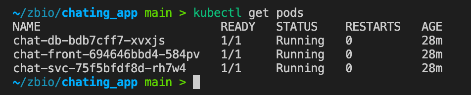
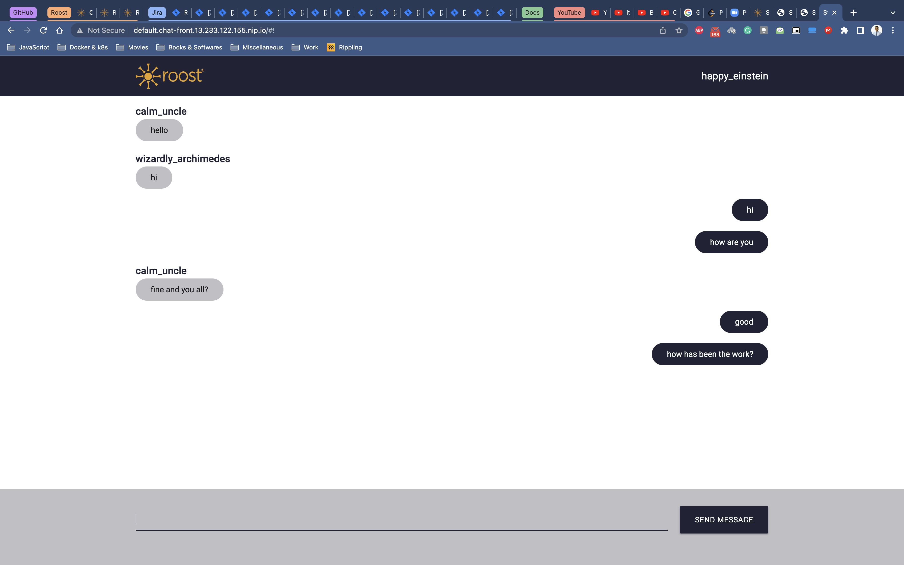

# Chat microservices

Example of 3 microservices and a database working in a Kubernetes cluster.

The objetive of this project is to show a real example of our library [PyMS](https://github.com/python-microservices/pyms),
[the template](https://github.com/python-microservices/microservices-template) and
the [scaffold](https://github.com/python-microservices/microservices-scaffold).

The tutorial of "how to create a cluster" is based of this [bitnami tutorial](https://docs.bitnami.com/kubernetes/get-started-kubernetes/)

# The project

- **chat_front:** Is a simple webpage that sends and receives messages from chat_svc through socket io
- **chat_svc:** Receives messages from chat_front and sends these messages to chat_db to store this information
- **chat_db:** Receives data from chat_svc and stores this information in a SQLite DB.

## Architecture


## Steps

1. Create the docker images:

```bash
docker build -t chat_db:v1 -f chat_db/Dockerfile chat_db/
docker build -t chat_svc:v1 -f chat_svc/Dockerfile chat_svc/
docker build -t chat_front:v1 -f chat_front/Dockerfile chat_front/
```

2. Check your helm charts:

```bash
helm upgrade --dry-run --install chat-front ./helm_chart/chat_front/ \
  --set ingress.enabled=true --set "ingress.hosts[0]=$(minikube ip).nip.io"
helm upgrade --dry-run --install chat-svc ./helm_chart/chat_svc/ --set \
  --set ingress.enabled=true --set "ingress.hosts[0]=svc.$(minikube ip).nip.io"
helm upgrade --dry-run --install chat-db ./helm_chart/chat_db/
```

3. Install helm charts:

```bash
helm upgrade --install chat-front ./helm_chart/chat_front/ \
  --set ingress.enabled=true --set "ingress.hosts[0]=$(minikube ip).nip.io"
helm upgrade --install chat-svc ./helm_chart/chat_svc/ --set \
  --set ingress.enabled=true --set "ingress.hosts[0]=svc.$(minikube ip).nip.io"
helm upgrade --install chat-db ./helm_chart/chat_db/
```

4. Verify that all pods are Ok:

```bash
kubectl get pods
```



5. Open the clusterIP:front_svc_port and see the magic! ;)


